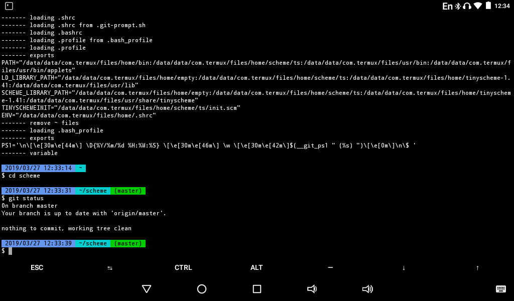

# home
## rc files for termux on Android

### contents
- ${HOME}/.shrc ${HOME}/.profile ${HOME}/.bashrc ${HOME}/.bash_profile
- ${HOME}/.emacs.d/init.el
- ${HOME}/.w3m/boolmark.html ${HOME}/.w3m/config ${HOME}/.w3m/keymap
- fortune data in japanese: goethe.fortune
- fetch and merge scripts for fortune data in japanese: fortune.rb
### load order

- sh, dash
	- login
		( [.profile](.profile)
			( [.shrc](.shrc) ))
	- every
		[.shrc](.shrc)

- bash
	- login
		( ( [.bashrc](.bashrc)
				( [.shrc](.shrc) ))
			( [.bash_profile](.bash_profile)
				( [.profile](.profile) )))
	- every
		( [.bashrc](.bashrc)
			( [.shrc](.shrc) ))

### commands

- sh, dash [.shrc](.shrc)

| commnd | description                                                      |
|:-------|:-----------------------------------------------------------------|
| args   | print arguments                                                  |
| bak    | delete ~file(emacs-backup-file)                                  |
| see    | when specified file, cat the file. when specified directory, ls. |
| d      | download                                                         |
| p      | gather pkg install                                               |
| m      | make wrapper                                                     |
| t      | readline-wrapped tinyscheme 1.41 with a few extensions           |

- bash [.bashrc](.bashrc)

| command | description |
|:-|:-|
| typetest | inspect variable whether it is specified type |
|| $ ary=(abc 123 xyz) |
|| $ typetest -a ary |
|| $ echo $? |
|| 0 |
| vars | echo name and value of variables |
|| $ ary1=(abc 123) |
|| $ ary2=(xyz) |
|| $ vars ary1 ary2 |
|| ary1=(abc 123) |
|| ary2=(xyz) |

### Snapshots
- bash

